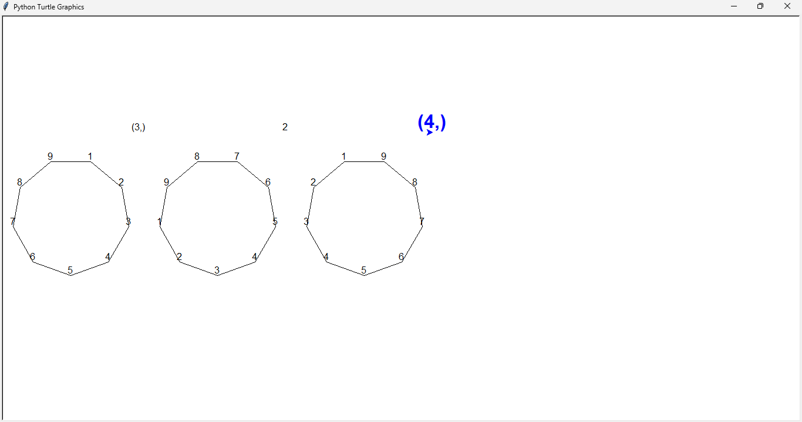

[Previous - Maps](maps.md)

### Dihedral Groups

The `groups\symmetries\dihedral.py` module helps studying and visualising symmetries in a regular polygon. A polygon is defined with the following characteristics:
- its number of sides;
- its state: the current order of its vertices;
- its symmetries: rotations union reflections.

Assuming the current state of a square is `[1, 2, 3, 4]`, then applying 2 unit rotations will make this current state into `[3, 4, 1, 2]`. Similarly other rotations and reflections can be applied.

**Nomenchlature.** The symmetries are named in a polygon as follows:
- rotations of *n* units: denoted by `n`;
- reflection about vertex at index *n*: denoted by `(n, )`;
- reflection about axis passing between vertices at index *n* and *n + 1*: denoted by `(n, n+1)`.

You can use that module to see how a polygon's vertices change upon applying various symmetries. Work will be continued on it.

#### Usage

Import the module:

```py
>>> from groups.symmetries import *
```

and define a polygon:

```py
>>> d9 = Dihedral(9) # note the case in Dihedral
>>> d9
D[1, 2, 3, 4, 5, 6, 7, 8, 9]
```

Now, you can apply the symmetries as defined in ¶Nomenchlature above. Here, 2 unit rotations will be `2`, a reflection about 4th vertex will be `(3, )`, and so on...

```py
>>> d9.apply(
...     [2, (3, )]
... )
[9, 8, 7, 6, 5, 4, 3, 2, 1]
>>> # which is ...
>>> d9.determine(_)
(4,)
```

Now, let us try to visualise this. Type

```py
>>> d9.visualise(
...     [2, (3, )]
... )
...
```

A turtle window should appear. Maximise it to see:



---

<br>

[Previous - Maps](Maps.md)